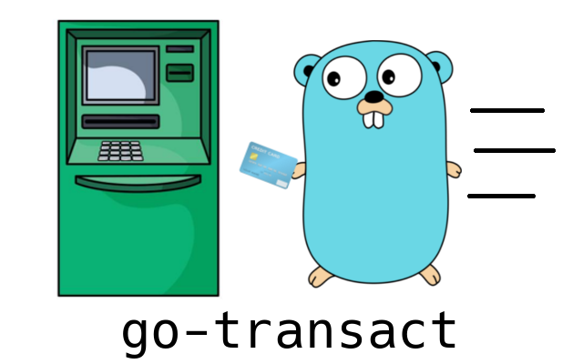

[](https://goreportcard.com/report/github.com/dtmirizzi/go-transact)
[](https://codecov.io/gh/dtmirizzi/go-transact)

## Install 
```$xslt
 go get -u github.com/dtmirizzi/go-transact
```
## Docs 
[Documentation](https://pkg.go.dev/github.com/dtmirizzi/go-transact/pkg)
## Problem
Often times in `synchronous` distributed systems you will have a set of processes 
that need to be performed at roughly the same time. 
To declare success all sub-processes must complete successfully, 
If one fails it is often common to revert state and retry. 
If synchronicity is not required the problem
is often better solved in an `asynchronous` fashion. This library is ment to provide a simple interface for handling said transactions.  
Based off ideas in ["A Model of Transactional Programming"](https://www.microsoft.com/en-us/research/wp-content/uploads/2016/02/tr-2008-19.pdf) and [Transaction processing](https://en.wikipedia.org/wiki/Transaction_processing)

## Use Case
You are tasked with creating a realtime user management engine by D. Corp.
To create an user you need to add a db table and insert the creds to AWS Incognito.
If either fail you would like to roll back your changes so that you can retry at another time.  

## Example 
```go
import "github.com/dtmirizzi/go-transact"

h := "hello"
W := "World!"
t := transact.NewTransaction()

CreateDBTable := func() error {
    // Do something
    fmt.Println(h + W)
    return nil
}
DeleteDBTable := func() error {
    // Do something
    return nil
}
t.AddProcess(&transact.Proc{
    PName:    "p0",
    UpFunc:   CreateDBTable,
    DownFunc: DeleteDBTable,
})

PutMessageOnQueue := func() error {
    // Do something
    return nil
}
DeleteMessageFromQueue := func() error {
    // Do something
    return nil
}
t.AddProcess(&transact.Proc{
    PName:    "p1",
    UpFunc:   PutMessageOnQueue,
    DownFunc: DeleteMessageFromQueue,
})

err := t.Transact()
if err != nil {
    if tErr, ok := err.(*transact.TransactionError); ok {
        fmt.Println(tErr)
        if !tErr.Safe() {
            panic("Failed to safely revert changes!")
        }
    } else {
        fmt.println(err)	
    }
}
```
## Development
- Install [Precommit](https://pre-commit.com/),
  [golangci-lint](https://github.com/golangci/golangci-lint).
- Run ```pre-commit install```
- Ship it!! 
